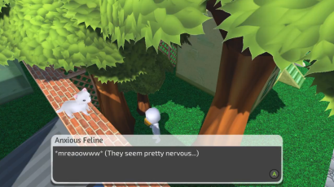
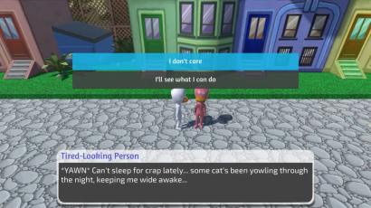
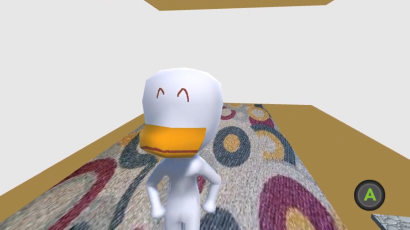
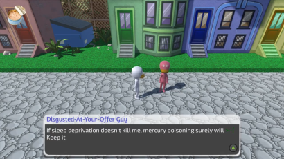

# Duckyboy 3D #

Duckyboy 3D is a prototype version of a mystery adventure game starring an anthropomorphic duck. The player must explore his environment and talk to other characters in order to solve a simple puzzle.

## Screenshots ##

## Features ##
* Developed in C# using the [Unity3D](https://unity.com/) game engine.
* Original character modeled in the 3d modeling software [Blender](https://www.blender.org/).
* An overhead camera that cuts to different shots/angles depending on the scene, and zooms in when traveling to certain areas.
* A 'hotspot' system for object interaction.
* Automatic controller prompts when near an interactable object or character.
  * The prompts show keys when the keyboard is in use, and gamepad buttons when a gamepad is in use.
* Conversations with other characters through integration with [Fungus](https://github.com/snozbot/fungus), an add-on that provides visual novel-like functionality.
* Multiple answer choices during conversation.

Original code and assets (c) 2017-2019 Colin Jones. All rights reserved.
